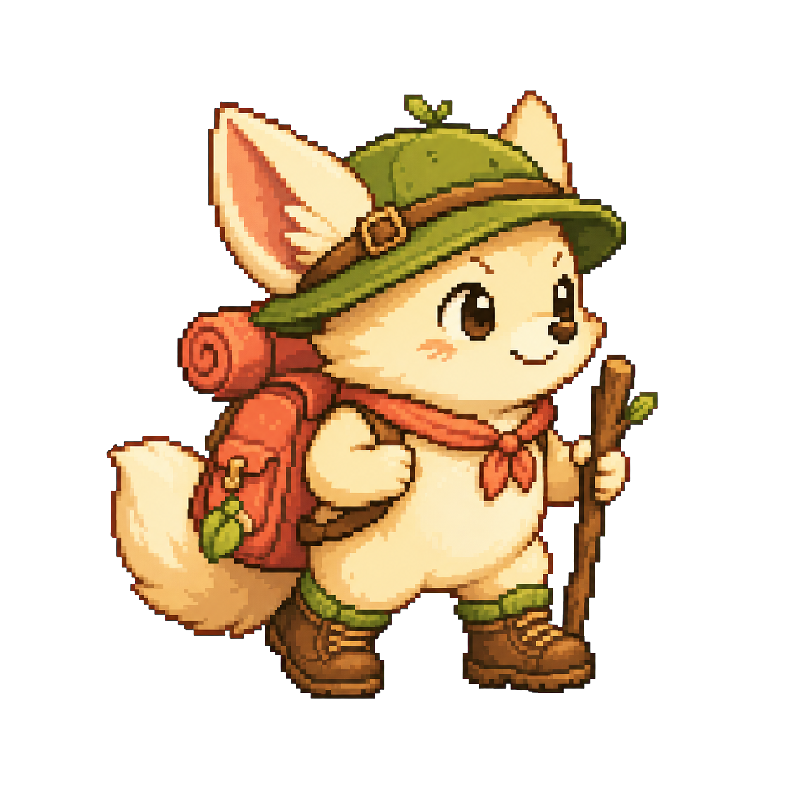
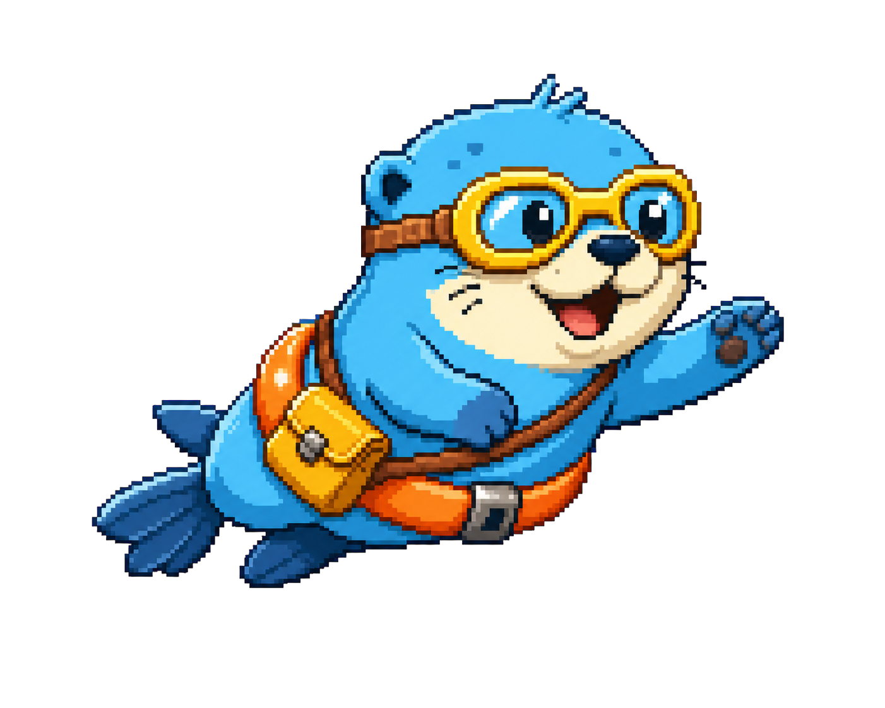
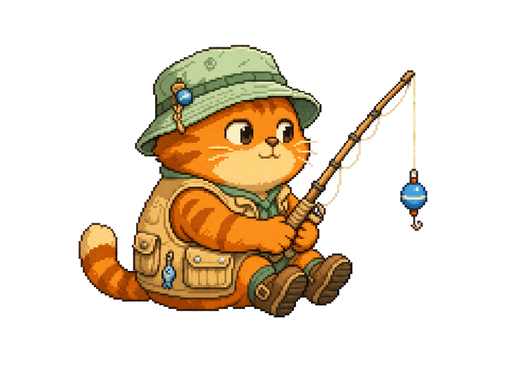

<div align="center">
  

  # Focus Quest

  **집중이 의무가 아니라, 완성하고 싶은 작은 모험이 되도록.**

  귀여운 픽셀 친구와 함께하는 반응형 포모도로 집중 타이머

  [🌐 바로 체험하기](https://hoya0328.github.io/focus-quest/) ·
  [📖 서비스 소개](#서비스-소개) ·
  [🗺️ 로드맵](#로드맵)

  
  
  
</div>

---

## 서비스 소개

**Focus Quest**는 타이머를 바라보는 시간을 작은 픽셀 모험으로 바꿉니다.

사용자는 등산, 수영, 낚시 중 오늘의 모험과 친구를 고릅니다. 집중 시간이 흐르는 동안 캐릭터가 화면 속 여정을 이어가며, 세션을 끝까지 완료하면 오늘의 모험 기록이 한 칸 쌓입니다.

휴대폰을 강제로 차단하지 않습니다. 전체 화면의 아늑한 장면과 캐릭터의 움직임으로 사용자가 자연스럽게 다른 앱에서 멀어지도록 설계했습니다.

## 왜 만들었나요?

일반적인 생산성 도구는 효율적이지만, 매일 다시 열고 싶을 만큼 애착이 생기기는 어렵습니다.

이 프로젝트는 다음 질문에서 출발했습니다.

> 생산성 도구에 게임의 기대감과 캐릭터에 대한 애착을 더하면, 집중을 더 즐거운 습관으로 만들 수 있을까?

## 핵심 경험

- **모험 친구 선택** — 모리, 나루, 보리와 세 지역 중 오늘의 여정 선택
- **나만의 포모도로** — 1~120분 집중 및 1~30분 휴식 설정
- **전체 화면 집중** — 진행률에 따라 움직이는 픽셀 캐릭터와 배경
- **저작권 걱정 없는 사운드** — 브라우저가 실시간 생성하는 앰비언트 BGM
- **부드러운 중단 경험** — 강제 차단 대신 일시정지와 모험 포기 확인
- **주간 모험 기록** — 게스트는 기기에 저장하고, 계정 사용자는 여러 기기에서 동기화
- **반응형 PWA** — PC와 모바일에서 사용하고 홈 화면에 설치

## 캐릭터

| 모리 | 나루 | 보리 |
|---|---|---|
|  |  |  |
| 해오름 봉우리 | 유리산호 유적 | 달비늘 호수 |

캐릭터와 UI는 기존 게임 에셋을 복제하지 않고 독자적인 고해상도 레트로 픽셀 아트로 제작했습니다.

## 제품 설계

```text
모험 선택
   ↓
집중·휴식·사운드 설정
   ↓
전체 화면 집중 모험
   ↓
집중 완료와 휴식 장면
   ↓
다음 집중 또는 주간 기록
```

단순한 시간 측정보다 `선택 → 몰입 → 완주 → 보상`의 감정 흐름에 집중했습니다.

## 기술 구성

- Next.js 16
- React 19
- TypeScript
- CSS 기반 반응형 픽셀 UI
- Web Audio API 기반 실시간 앰비언트 사운드
- LocalStorage 기반 게스트 기록과 Supabase 기반 계정 동기화
- 이메일 인증 및 사용자별 Row Level Security
- Service Worker 및 Web App Manifest
- Cloudflare Worker + Static Assets 공개 배포 구성

## 로컬 실행

```bash
npm install
npm run dev
```

## 로드맵

- [x] 캐릭터 선택과 세 가지 모험
- [x] 사용자 지정 포모도로
- [x] 전체 화면 집중 모드
- [x] 실시간 생성 BGM
- [x] 모바일·PC 반응형 PWA
- [x] 휴식 전용 장면과 집중·휴식 자동 순환
- [x] 주간 집중 리포트와 최근 세션 기록
- [x] 새로고침 후 진행 중 타이머 복구
- [ ] 캐릭터 장비와 배지 수집
- [ ] 새로운 모험 지역
- [ ] 앱스토어용 네이티브 패키징

## 포트폴리오 노트

이 프로젝트는 **개발로 창작하는 걸 즐기는 PM**을 지향하며 만든 첫 번째 포트폴리오 프로젝트입니다.

문제를 정의하고, 핵심 경험을 설계하고, 캐릭터와 인터랙션을 구체화한 뒤 실제로 작동하는 제품까지 연결했습니다. 완성된 결과뿐 아니라 사용자 피드백에 따라 콘셉트와 구현을 빠르게 바꾸는 과정도 제품 작업의 일부로 담았습니다.

---

<div align="center">
  <strong>오늘도 한 퀘스트, 나만의 속도로 앞으로.</strong>
</div>
