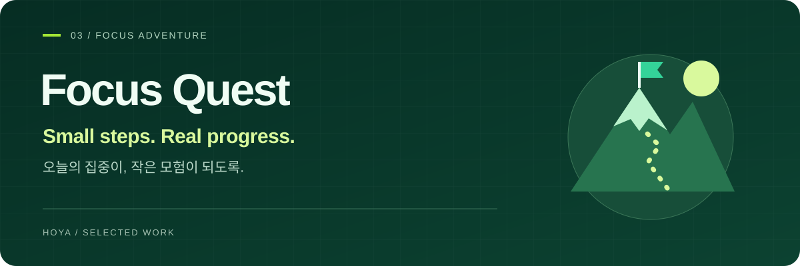
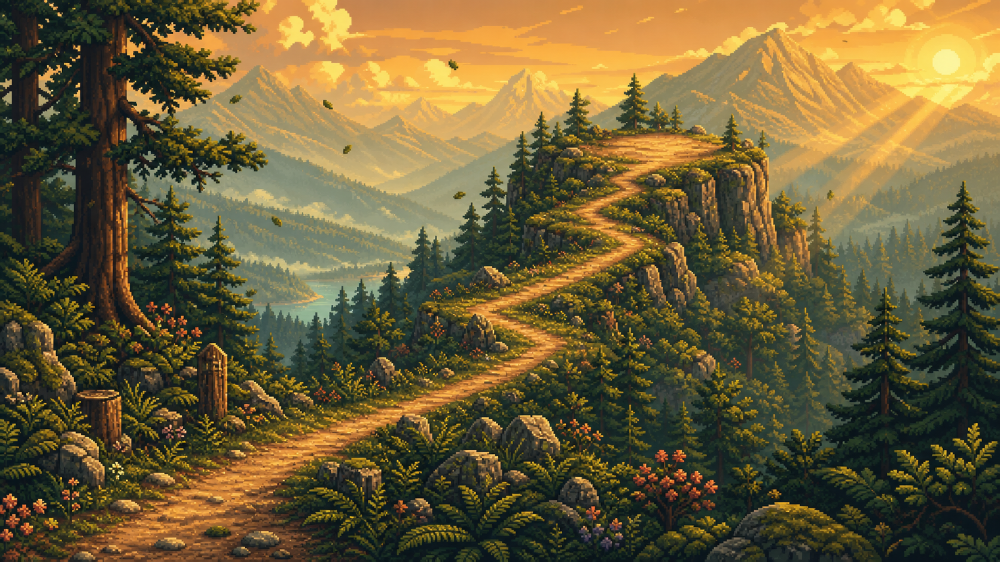
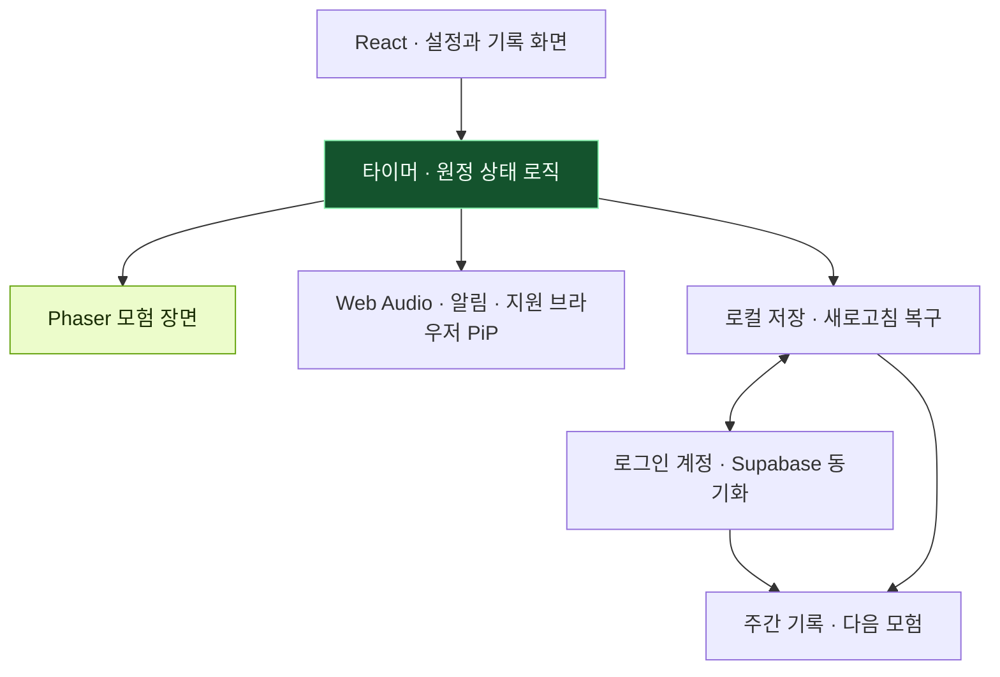

<p align="center">
  
</p>

<p align="center">
  <a href="https://focus-quest.hoya0328.workers.dev"></a>
  
  
  <a href="https://github.com/hoya0328/focus-quest/actions/workflows/ci.yml"></a>
</p>

# Focus Quest

**집중한 시간을 작은 모험으로 보여주고, 잠시 멈추더라도 다시 시작할 수 있도록 돕는 포모도로 서비스입니다.**

[서비스 사용해 보기](https://focus-quest.hoya0328.workers.dev) · [제품 설계](docs/PROJECT_CONTEXT.md) · [아키텍처](docs/ARCHITECTURE.md) · [로드맵](docs/ROADMAP.md)

## 프로젝트를 시작한 이유

집중 앱이 해야 하는 일이 꼭 다른 앱을 막거나 연속 기록을 유지하게 하는 것만은 아니라고 생각했습니다. 공부를 시작하기 전에 잠깐 보고 싶고, 도중에 멈췄더라도 부담 없이 돌아올 수 있는 화면을 만들고 싶었습니다.

Focus Quest에서는 등산·수영·낚시 중 모험을 선택합니다. 집중하는 동안 캐릭터가 앞으로 나아가고, 세션을 마치면 오늘의 모험이 하나 완성됩니다. 긴 목표를 중단한 뒤에는 5분이나 10분처럼 더 작은 목표로 다시 시작할 수 있습니다.

**완벽하게 지키는 하루보다, 내 속도로 다시 이어가는 경험**을 제품의 기준으로 삼았습니다.

## 함께 모험하는 친구들

| 산길잡이 **모리** | 유적 잠수부 **나루** | 낚시꾼 **보리** |
| :---: | :---: | :---: |
|  |  |  |
| 해오름 봉우리 | 유리산호 유적 | 달비늘 호수 |

캐릭터와 배경은 프로젝트 고유의 픽셀 아트 방향으로 구성했습니다. 모험 장면은 Phaser로 표현하고, 설정·기록 같은 일반 화면은 React와 CSS로 구현해 역할을 나눴습니다.

<p align="center">
  
  <br />
  <sub>등산 모험에 사용하는 배경 아트입니다. 타이머와 캐릭터는 실제 서비스에서 함께 표시됩니다.</sub>
</p>

## 시작하고, 집중하고, 다시 이어갑니다

| 순간 | 제공하는 경험 |
| :--- | :--- |
| **시작 전** | 모험과 목표를 고르고 집중 1~120분, 휴식 1~30분을 설정합니다. |
| **집중 중** | 캐릭터의 진행을 보며 집중하고, 전체 화면·배경음·지원 브라우저의 작은 타이머를 사용합니다. |
| **한 세트 완료** | 집중과 휴식을 연결하고, 2~4세트 원정에서는 중간 체크포인트를 지나갑니다. |
| **도중에 중단** | 최근 모험을 이어가거나 Recovery Quest로 목표를 짧게 바꿔 다시 시작합니다. |
| **돌아보기** | 주간 기록과 완주한 시간대·집중 길이를 확인하고 다음 목표를 정합니다. |

앱 실행 중 알림과 초대 코드 기반 **Silent Camp**도 구현했습니다. Silent Camp는 함께 접속한 상태를 확인하는 베타 기능이며, 채팅이나 목표 내용 공유를 제공하는 서비스는 아닙니다. 일부 기능은 브라우저 지원과 권한 설정에 따라 달라집니다.

## 설계에서 중요하게 다룬 점

### 1. 중단을 별도의 사용자 흐름으로 다뤘습니다

집중 성공 화면만 만드는 대신, 일시정지·중단·다시 시작하는 상태를 함께 설계했습니다. 끝내지 못한 긴 목표를 짧은 목표로 바꾸는 Recovery Quest와 최근 모험 재시작을 통해 복귀에 필요한 선택을 줄였습니다.

### 2. 타이머 상태와 화면 연출의 책임을 나눴습니다

타이머 규칙은 독립적인 상태 로직으로 관리하고, Phaser 장면은 그 진행 상태를 시각적으로 표현합니다. 집중·휴식 전환과 원정의 마지막 성공 장면을 구분해 화면의 연출이 실제 세션 상태와 어긋나지 않도록 했습니다.

### 3. 게스트로 시작하고, 필요한 시점에 계정으로 확장합니다

로그인 전에는 브라우저에 기록을 저장하고, 로그인 후에는 Supabase를 통해 계정 기록을 동기화합니다. 새로고침 후 진행 중인 타이머를 복구하는 경로와 클라우드 상태 병합을 따로 검증합니다. 게스트 기록은 해당 브라우저의 저장소에 의존한다는 한계도 분명히 둡니다.

### 4. 지속적인 외부 호출 없이도 기본 경험을 유지합니다

배경음은 Web Audio API로 생성하고, 기본 추천은 기기 내 기록과 규칙을 활용합니다. 집중과 회고를 사용할 때마다 AI 호출이 필요하지 않도록 구성했습니다. 실제 AI 기반 추천과 앱이 종료된 상태의 예약 푸시는 별도의 후속 과제로 구분합니다.

## 시스템 구조



| 영역 | 기술과 책임 |
| :--- | :--- |
| 앱 구조 | Next.js · React · TypeScript, 화면과 제품 상태를 관리합니다. |
| 실행·빌드 | Vinext · Vite, Cloudflare Worker 대상 빌드를 구성합니다. |
| 모험·사운드 | Phaser · Web Audio API, 픽셀 장면과 배경음을 표현합니다. |
| 기록·인증 | LocalStorage · Supabase, 게스트 기록과 계정 동기화를 나눕니다. |
| 설치 경험 | Service Worker · Web App Manifest 기반 PWA입니다. |
| 검증 | 제품 규칙 테스트·린트·빌드·렌더링 검사를 CI에서 수행합니다. |

## 구현 상태와 다음 과제

**구현한 범위:** 세 가지 모험, 포모도로와 여러 세트 원정, 중단 후 복귀, 주간 기록, 타이머 복구, 계정 동기화, PWA와 Silent Camp 베타입니다.

**추가 검증할 범위:** 실제 브라우저에서 알림·작은 타이머·다중 계정 캠프의 상호작용을 확인하는 QA입니다. 저장소의 구현 내용과 공개 배포의 반영 상태가 다를 수 있어 [인수인계](docs/HANDOFF.md)와 [QA 기록](docs/QA_REPORT_2026-08-11.md)을 함께 관리합니다.

**후속 범위:** 모험 지역과 캐릭터 성장 요소 확장, 선택적 AI 추천, 네이티브 앱 패키징입니다. 앱을 닫은 상태의 예약 푸시는 현재 기본 기능에 포함하지 않습니다.

<details>
<summary><strong>로컬 실행과 검증</strong></summary>

Node.js 22.13 이상이 필요합니다.

```bash
git clone https://github.com/hoya0328/focus-quest.git
cd focus-quest
npm install
npm run dev
```

게스트 집중 흐름과 로그인 기반 기능의 설정 범위는 [프로젝트 세팅](docs/SERVICE_SETUP.md)을 참고해 주세요. 외부 연동 키와 개인 환경 파일은 저장소에 올리지 않습니다.

```bash
npm run test:logic
npm run lint
npm run build
node --test tests/rendered-html.test.mjs
```

`npm run build`는 현재 Vinext 기반 Cloudflare Worker 빌드를 수행합니다. 일반적인 Next.js 정적 내보내기나 GitHub Pages 배포와는 구분합니다.

</details>

## 더 자세한 문서

| 궁금한 내용 | 문서 |
| :--- | :--- |
| 사용자 문제와 제품 방향 | [프로젝트 맥락](docs/PROJECT_CONTEXT.md) · [퀘스트 설계](docs/QUEST_MVP.md) |
| 구조와 설계 배경 | [아키텍처](docs/ARCHITECTURE.md) · [설계 결정](docs/DECISIONS.md) |
| 실행 환경과 검증 | [프로젝트 세팅](docs/SERVICE_SETUP.md) · [QA 기록](docs/QA_REPORT_2026-08-11.md) |
| 다음 개발 범위 | [로드맵](docs/ROADMAP.md) · [인수인계](docs/HANDOFF.md) |

---

[기여 안내](CONTRIBUTING.md) · [보안 제보](SECURITY.md) · [권리·출처 고지](NOTICE.md) · [HOYA의 다른 프로젝트](https://github.com/hoya0328)
